# Palačinkara Njam-Njam

## Kratki opis teme

Ova web aplikacija predstavlja interaktivnu platformu za pregled, naručivanje i upravljanje ponudom poslastica poput palačinaka, waffli, torti i pića. Projekt je razvijen u okviru timskog rada, koristeći moderni React frontend u kombinaciji sa json-server backendom za pohranu podataka.

**Funkcionalnosti:**
- Pregled ponude bez registracije
- Registrovani korisnici mogu dodavati proizvode u korpu i naručivati
- Admin korisnici mogu dodavati, ažurirati i uklanjati proizvode

Cilj je jednostavno korisničko iskustvo za posjetioce i efikasno upravljanje menijem za admine.

---

## Tehnologije korištene u radu

### React
- Funkcionalne komponente i hooks (useState, useEffect)
- React Router za SPA navigaciju
- Zaštita ruta (RequireAdmin)

### Context API
- ProductContext i CartContext za globalno upravljanje stanjem

### JavaScript (ES6+)
- Destrukturiranje, arrow funkcije, async/await, regex

### HTML5 i CSS3
- Semantički HTML5
- Moderni CSS za layout i responzivnost

### Integracija Google Maps
- Google Maps iframe za prikaz lokacije

### Local Storage
- Pohrana korisničkih podataka i uloga

### Ostali alati
- Create React App
- NPM

---

## Opis strukture projekta (mapa/fajlova)

- **Root folder**: `palacinkara-njam-njam`
- **node_modules/**: biblioteke
- **public/**: statični fajlovi + slike
- **src/**: sav izvorni kod
  - Komponente po funkciji
  - Context fajlovi
  - `App.js`
  - CSS fajlovi
- **Konfiguracioni fajlovi:**
  - `.gitignore`, `db.json`, `package.json`

Modularna i organizovana struktura omogućava jednostavno održavanje.

---

## Funkcionalnosti i opis dizajna

### Funkcionalnosti
- Fiksni navigacioni meni
- Hero sekcija sa fiksiranom pozadinom
- "O nama" sekcija
- Sekcija događaja sa hover efektima
- Galerija slika
- Validirana kontakt forma
- Admin panel
- Dinamične kartice proizvoda i korpa
- Fiksno dugme za naručivanje

### Opis dizajna
- Fleksibilni layouti (Flexbox, Grid)
- Jasna hijerarhija vizuelnih elemenata
- Efekti senki i prelaza
- Pozadinske slike

### Paleta boja
- **Žuta:** #F4C542, #fcd34d, #c7990f
- **Tamno siva / crna:** #333333, #000000
- **Bijela:** #ffffff, #fffbea
- **Neutralne sive**

### Fontovi
- **Lexend** (Google Fonts)
- Fallback: sans-serif

---

## Uloge korisnika

### Admin (Administrator)
- Pristup admin panelu
- Dodavanje/uređivanje proizvoda

### Guest (Posjetilac / Neregistrovani korisnik)
- Pregled javnih sekcija
- Pregled ponude
- Slanje poruka
- Registracija / prijava

### Registrovani korisnik
- Prijava
- Uređivanje profila
- Dodavanje proizvoda u korpu

---

## Kratki opis doprinosa svakog člana tima

Kratki opis doprinosa svakog člana tima
Aplikacija je rezultat timske saradnje i zajedničkog dogovora između tri članice: Tajre Tašić,
Ajne Karić i Aide Begagić. Tokom cijelog procesa, sve ključne odluke o dizajnu,

12
funkcionalnosti i implementaciji su donošene zajednički. Iako je svaki član tima imao glavnu
oblast djelovanja, svi su doprinijeli i u drugim dijelovima aplikacije – od CSS-a, preko
frontend i backend koda, do testiranja i validacije.
Često su se vršile izmjene i poboljšanja kroz međusobno savjetovanje, a svaka članica je
radila i manje korekcije u oblastima koje formalno nisu bile njena primarna odgovornost, što
je dodatno doprinijelo kvaliteti i timskom duhu.

---

## Upute za pokretanje projekta

1. **Kloniranje repozitorija**
```bash
git clone <repo-url>
```

2. **Instalacija zavisnosti**
```bash
npm install
```

3. **Pokretanje React aplikacije**
```bash
npm start
```

4. **Pokretanje json-server baze**
```bash
json-server --watch db.json --port 3001
```

**Napomena:** koristiti dva terminala (React + json-server)

---

## Snimci ekrana radne aplikacije

## Snimci ekrana radne aplikacije

### Home Page
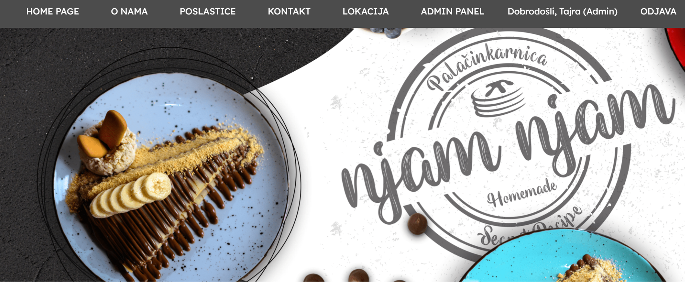

### O nama
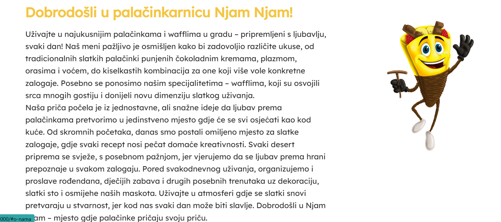

### Odabir poslastica
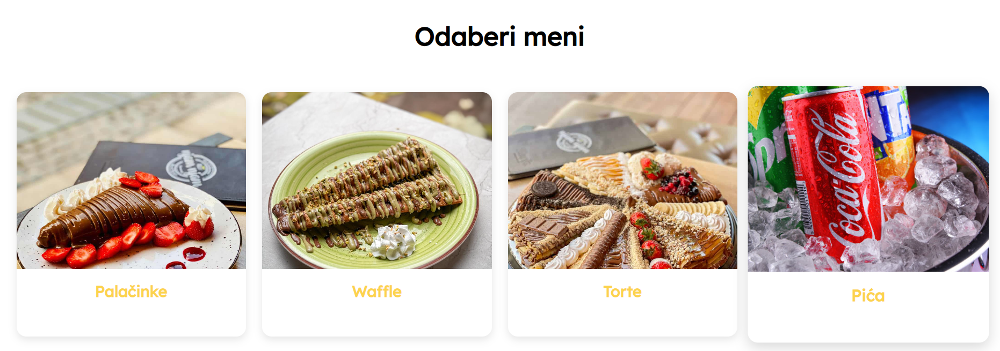

### Palačinke
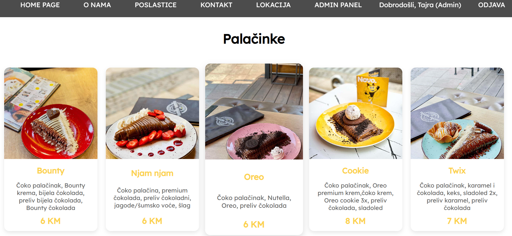

### Waffli
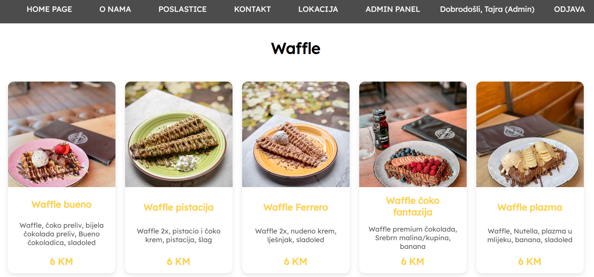

### Torte
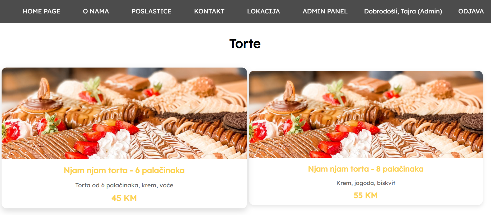

### Pića
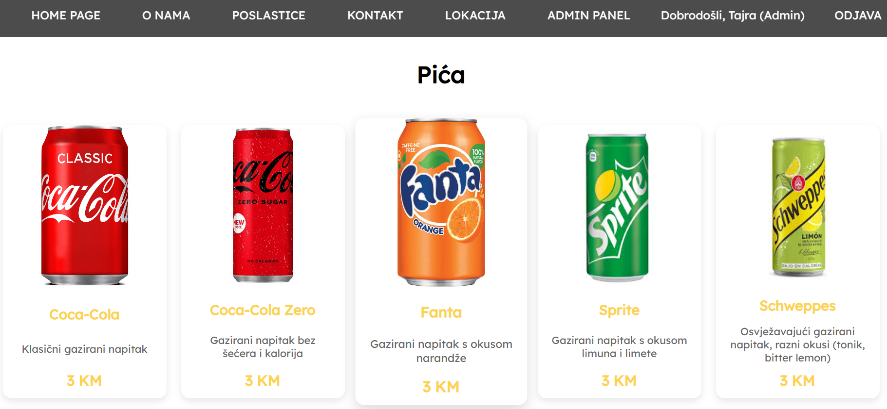

### Kontakt i lokacija
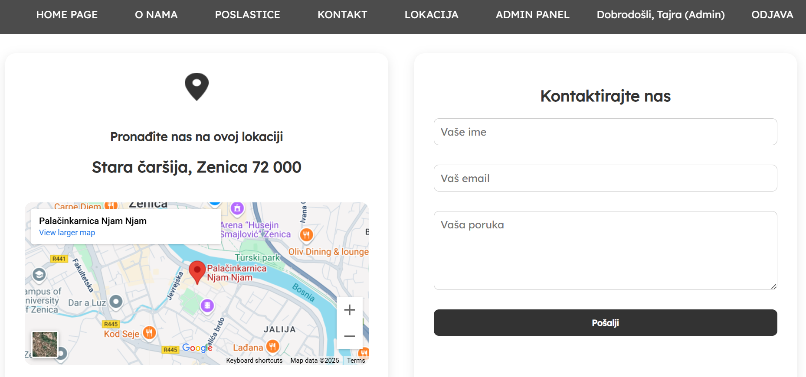

### Prijava
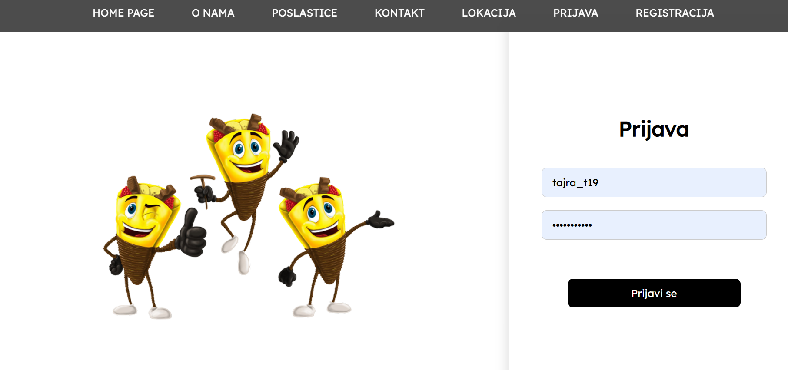

### Registracija
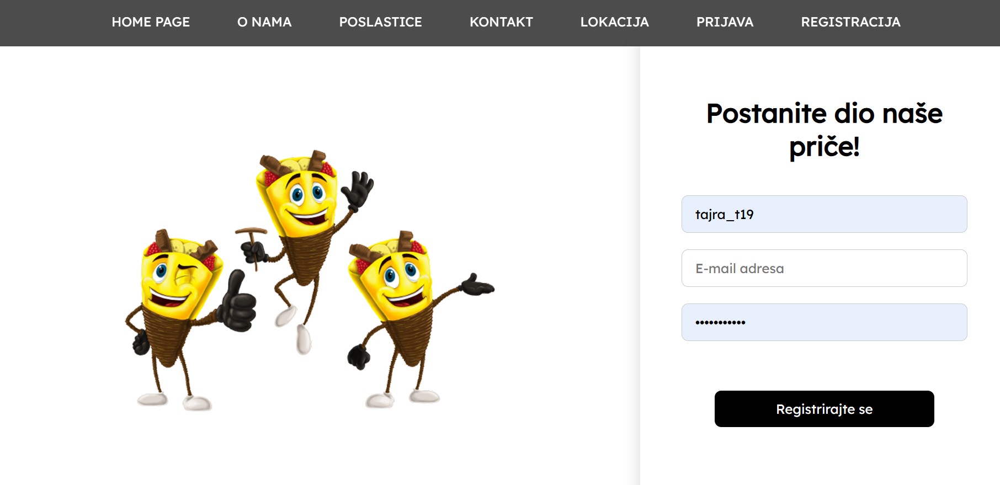

### (Guest) Ponude
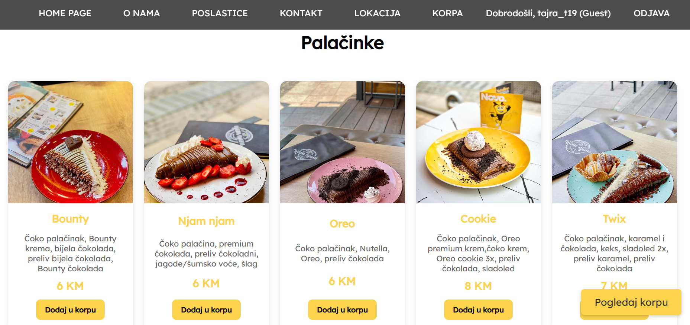

### (Guest) Korpa
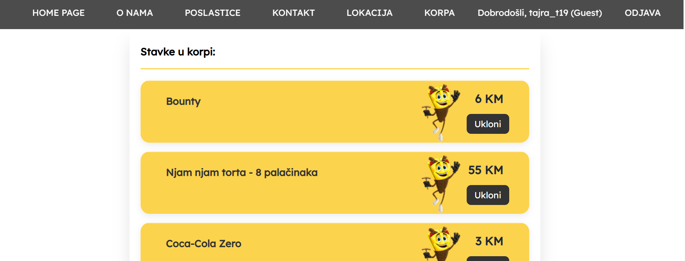

### Admin panel


Univerzitet u Zenici  
Politehnički fakultet  
Softverski inženjering  
Operativni sistemi i računarstvo u oblaku  

Članovi tima:  
**Tašić Tajra, Karić Ajna, Begagić Aida**  

Zenica 2025.
